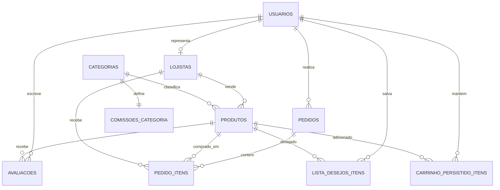

# Beauty Marketplace - Entrega 3 - Arquitetura

Esta entrega corresponde ao **Bloco 3 - Arquitetura** do Projeto Integrador. O material apresenta a arquitetura do Beauty Marketplace em camadas, partindo da visão de contexto do sistema até chegar à modelagem de dados relacional e não relacional utilizada como base do projeto.

## Objetivo

Apresentar a arquitetura completa do sistema, cobrindo os diagramas C4, o uso de Diagrams as Code e a modelagem de dados com **MySQL**, **MongoDB** e **Redis**, sempre relacionando cada artefato com o funcionamento real do marketplace.

## 1. Identificação do grupo

- Número do grupo: **[preencher número do grupo]**
- Integrante 1: **[nome completo]** - RA **[RA]**
- Integrante 2: **[nome completo]** - RA **[RA]**
- Integrante 3: **[nome completo]** - RA **[RA]**
- Integrante 4: **[nome completo]** - RA **[RA]**

## 2. Diagrama C4 - Nível Context (C1)

Arquivo fonte do diagrama: `diagramas/c1-context.puml`

O diagrama C1 apresenta o Beauty Marketplace como sistema central e evidencia quem interage com a plataforma, quais integrações externas participam do fluxo e qual é o papel de cada elemento no ecossistema do produto.

### Elementos representados

| Elemento | Tipo | Descrição |
| --- | --- | --- |
| Consumidor | Usuário | Pesquisa, filtra, compra produtos de beleza, avalia itens e acompanha entregas. |
| Lojista | Usuário | Cadastra produtos, acompanha vendas, gerencia estoque e recebe pedidos. |
| Administrador | Usuário | Aprova ou reprova lojistas, modera produtos, define comissões por categoria e monitora a plataforma. |
| Beauty Marketplace | Sistema | Centraliza catálogo, carrinho multi-lojista, checkout, avaliações, lista de desejos e rastreio. |
| Gateway de pagamento | Sistema externo | Autoriza o pagamento único e distribui valores entre lojistas por split. |
| Correios/Transportadoras | Sistema externo | Calcula frete, prazo e atualização de rastreio por item. |
| Serviço de e-mail/notificações | Sistema externo | Envia confirmações, avisos de pedidos e mensagens de recuperação de carrinho. |
| Redes sociais e comunidade | Sistema externo/social | Representa a origem de tendências, resenhas e prova social que influenciam a decisão de compra. |

## 3. Diagrama C4 - Nível Container (C2)

Arquivo fonte do diagrama: `diagramas/c2-container.puml`

O diagrama C2 detalha os principais containers da solução, mostrando como a interface, a aplicação, os bancos de dados e as integrações externas se relacionam para sustentar os fluxos do marketplace.

### Containers, tecnologias e justificativas

| Container | Tecnologia | Responsabilidade | Justificativa |
| --- | --- | --- | --- |
| Navegador / Mobile Web | Razor Views, Bootstrap, HTML, CSS e JavaScript | Interface responsiva para consumidor, lojista e administrador. | Permite demonstrar todos os fluxos do sistema em ambiente web, sem necessidade de aplicativo nativo. |
| Aplicação ASP.NET Core MVC | ASP.NET Core MVC, EF Core e Identity | Controllers, regras de negócio, autenticação por roles, carrinho, pedidos, lojista e administração. | É a base do projeto, reduz complexidade de integração e segue o padrão arquitetural adotado na disciplina. |
| MySQL | Banco relacional | Modelo oficial de usuários, lojistas, produtos, pedidos, comissões e avaliações. | Atende bem dados transacionais, integridade referencial e consultas relacionais. |
| SQLite local | Banco relacional embarcado | Execução local do protótipo durante demonstração e desenvolvimento. | Simplifica a apresentação do sistema sem substituir a modelagem oficial da entrega, que permanece em MySQL. |
| MongoDB | Banco de documentos | Armazena avaliações com mídia e atributos flexíveis relacionados ao perfil de beleza. | Permite evoluir o formato dos documentos sem depender de alterações frequentes no schema relacional. |
| Redis | Cache chave-valor | Acelera carrinho, TTL de abandono e ranking de produtos visualizados. | Reduz latência em operações frequentes e apoia cenários de recomendação simples. |
| Gateway de pagamento | API externa | Processa pagamento único e split por lojista. | É essencial para o modelo de negócio multi-vendedor do marketplace. |
| Correios/Transportadoras | API externa | Fornece frete, prazo e rastreio. | Sustenta a entrega por item e por lojista dentro de uma compra unificada. |
| E-mail/notificações | API externa | Envia confirmações, alertas de pedido e recuperação de carrinho. | Apoia a comunicação transacional e a retenção do consumidor. |

## 4. Diagrama C4 - Nível Component (C3)

Arquivo fonte do diagrama: `diagramas/c3-component-backend.puml`

O container detalhado no C3 é a **Aplicação ASP.NET Core MVC**, pois é nele que estão concentradas as regras que organizam catálogo, carrinho, checkout, pedidos, moderação e autenticação.

### Componentes do container principal

| Componente | Responsabilidade |
| --- | --- |
| ProdutoController | Exibe catálogo público, busca, filtros de beleza, detalhes, avaliações e recomendações. |
| CarrinhoController | Gerencia carrinho do consumidor, itens de múltiplos lojistas, validação de estoque, checkout, frete e split. |
| PedidosController | Exibe histórico de pedidos e rastreamento por item/lojista. |
| ListaDesejosController | Permite salvar e remover produtos da lista de desejos. |
| LojistaController | Mostra dashboard do lojista, vendas, notificações, cadastro/edição de produtos, upload de imagem, estoque e status de envio. |
| AdminController | Aprova ou reprova lojistas e produtos, ajusta comissões por categoria e apresenta o mapa de atendimento dos requisitos. |
| ASP.NET Identity | Controla login, cadastro e roles `Consumidor`, `Lojista` e `Administrador`. |
| ApplicationDbContext | Mapeia entidades relacionais e centraliza o acesso a dados com EF Core. |
| CartService | Sincroniza carrinho em sessão e banco local, mantendo persistência por alguns dias e limpando itens expirados. |
| SessionExtensions | Serializa o carrinho na sessão do usuário durante a navegação. |
| MarketplaceSeeder | Cria dados de demonstração: roles, usuários, lojistas, produtos, categorias e avaliações. |
| Integrações de domínio | Representam cálculo de frete, prazo, split, repasse, rastreio e notificações demonstráveis. |

## 5. Diagrams as Code

Os diagramas C4 foram implementados em **PlantUML** com apoio da biblioteca **C4-PlantUML**, atendendo ao requisito de Diagrams as Code. O código-fonte dos diagramas fica versionado junto com a documentação, o que facilita manutenção, revisão e rastreabilidade.

### Arquivos fonte

- `diagramas/c1-context.puml`
- `diagramas/c2-container.puml`
- `diagramas/c3-component-backend.puml`

### Geração dos diagramas

Com PlantUML instalado, os diagramas podem ser regenerados com:

```bash
plantuml "docs/Entrega 3/diagramas/*.puml"
```

## 6. Modelagem de dados - SQL (MySQL)

Arquivo fonte: `sql/mysql-schema.sql`

O modelo relacional oficial da entrega foi estruturado em **MySQL** para representar as entidades transacionais do marketplace. O script contempla mais de cinco tabelas, chaves primárias, chaves estrangeiras, restrições e índices, cobrindo o núcleo funcional do sistema.

### Tabelas principais

| Tabela | Finalidade |
| --- | --- |
| usuarios | Armazena consumidores, lojistas e administradores autenticados. |
| lojistas | Guarda dados comerciais, CNPJ, documentos e status de aprovação. |
| categorias | Organiza grupos comerciais como skincare, maquiagem e cabelo. |
| comissoes_categoria | Define o percentual de comissão vigente por categoria. |
| produtos | Representa o catálogo com slug único, filtros de beleza, preço, estoque, imagem, lojista e status de moderação. |
| pedidos | Registra o cabeçalho da compra realizada pelo consumidor. |
| pedido_itens | Registra os itens do pedido por produto e lojista, incluindo split e rastreio. |
| avaliacoes | Mantém a prova social relacional básica vinculada a usuário e produto. |
| lista_desejos_itens | Guarda produtos salvos pelo consumidor para compra futura. |
| carrinho_persistido_itens | Guarda itens de carrinho com expiração para recuperação de compra não finalizada. |

### Relacionamentos principais

- Um usuário pode atuar como consumidor, lojista ou administrador.
- Um lojista pode possuir vários produtos no catálogo.
- Uma categoria pode classificar muitos produtos e possui uma configuração de comissão.
- Um consumidor pode realizar vários pedidos.
- Um pedido possui vários itens.
- Cada item de pedido referencia produto e lojista para viabilizar split e rastreio por vendedor.
- Um produto pode receber várias avaliações.
- Um usuário pode manter itens em lista de desejos e carrinho persistido.
- Um produto só pode aparecer no catálogo público quando estiver com moderação aprovada.

### DER em formato textual



## 7. Modelagem de dados - NoSQL

### MongoDB

Arquivo fonte: `nosql/mongodb-avaliacoes.json`

Coleção: `avaliacoes_produto`

Caso de uso: armazenar avaliações ricas com comentário, fotos, vídeos, atributos de beleza, status de moderação, compra verificada e curtidas.

Justificativa: no contexto de produtos de beleza, a prova social pode variar bastante conforme categoria, tipo de mídia e perfil do consumidor. O modelo documental do MongoDB permite guardar essas variações com flexibilidade, sem exigir mudanças frequentes no modelo relacional principal.

### Redis

Arquivo fonte: `nosql/redis-estruturas.md`

Estruturas modeladas:

- `cart:{usuarioId}` como Hash com TTL de 30 minutos para carrinho rápido.
- `ranking:produtos:visualizados` como Sorted Set para recomendação simples por popularidade.
- `cart:abandoned:{usuarioId}` como resumo temporário para recuperação de carrinho abandonado.

Justificativa: o Redis reduz latência em operações temporárias e de alta frequência, aliviando o banco relacional e apoiando funcionalidades como recomendação e recuperação de carrinho.

## 8. Critérios de avaliação atendidos

| Critério | Peso | Atendimento no projeto |
| --- | --- | --- |
| Qualidade e completude dos diagramas C4 | 30% | Os níveis C1, C2 e C3 foram elaborados em PlantUML, com descrição textual e coerência com o sistema implementado. |
| Uso correto de Diagrams as Code | 10% | Os arquivos `.puml` estão versionados no repositório e podem ser regenerados a qualquer momento. |
| Qualidade do modelo relacional (SQL) | 30% | O script MySQL cobre o domínio principal com 10 tabelas, relacionamentos, restrições e índices. |
| Qualidade da modelagem NoSQL | 30% | MongoDB e Redis foram modelados com caso de uso claro e justificativa alinhada ao contexto do marketplace. |
