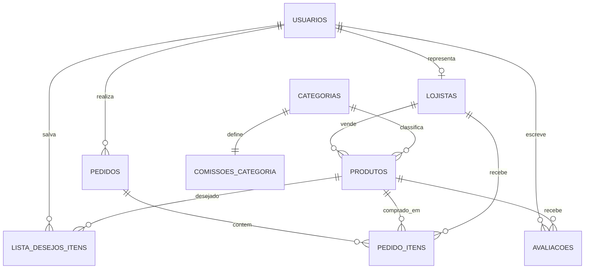

# Beauty Marketplace - Entrega 3 - Arquitetura

## 1. Identificação do grupo

- Número do grupo: **[preencher número do grupo]**
- Integrante 1: **[nome completo]** - RA **[RA]**
- Integrante 2: **[nome completo]** - RA **[RA]**
- Integrante 3: **[nome completo]** - RA **[RA]**
- Integrante 4: **[nome completo]** - RA **[RA]**

## Objetivo da entrega

Apresentar a arquitetura completa do Beauty Marketplace, desde a visão de alto nível com C4 até os modelos de dados relacional e não-relacional. A entrega usa C4-PlantUML como Diagrams as Code, MySQL para o modelo relacional e MongoDB/Redis para a modelagem NoSQL.

O Beauty Marketplace centraliza produtos de beleza de diferentes lojistas em uma única plataforma. O sistema atende consumidores que desejam comparar produtos por perfil de beleza, comprar de múltiplos vendedores em um carrinho unificado e acompanhar pedidos com rastreio por item. Também atende lojistas, que precisam gerenciar estoque e vendas, e administradores, que controlam aprovação de lojistas e comissões por categoria.

## 2. Diagrama C4 - Nivel Context (C1)

Arquivo fonte do diagrama: `diagramas/c1-context.puml`

O diagrama de contexto apresenta o Beauty Marketplace como sistema central e mostra sua relação com usuários e sistemas externos.

### Elementos do C1

| Elemento | Tipo | Descrição |
| --- | --- | --- |
| Consumidor | Usuario | Pesquisa, filtra, compra produtos de beleza, avalia itens e acompanha entregas. |
| Lojista | Usuario | Cadastra produtos, acompanha vendas, gerencia estoque e recebe pedidos. |
| Administrador | Usuario | Aprova ou reprova lojistas, define comissoes por categoria e monitora a plataforma. |
| Beauty Marketplace | Sistema | Centraliza catalogo, carrinho multi-lojista, checkout, avaliacoes, lista de desejos e rastreio. |
| Gateway de pagamento | Sistema externo | Autoriza pagamento único e distribui valores entre lojistas por split. |
| Correios/Transportadoras | Sistema externo | Calcula preço de frete, prazo e status de rastreio. |
| Serviço de e-mail/notificações | Sistema externo | Envia confirmações, avisos de novos pedidos e recuperação de carrinho abandonado. |
| Redes sociais e comunidade | Sistema externo/social | Representa origem de resenhas, tendências e prova social que influenciam a compra. |

## 3. Diagrama C4 - Nivel Container (C2)

Arquivo fonte do diagrama: `diagramas/c2-container.puml`

O diagrama de containers detalha os blocos executaveis e de armazenamento envolvidos na solucao.

### Containers e justificativas tecnológicas

| Container | Tecnologia | Responsabilidade | Justificativa |
| --- | --- | --- | --- |
| Navegador / Mobile Web | Razor Views, Bootstrap, HTML, CSS e JavaScript | Interface responsiva para consumidor, lojista e administrador. | Permite demonstrar os fluxos do marketplace em ambiente web e mobile sem criar aplicativo nativo. |
| Aplicacao ASP.NET Core MVC | ASP.NET Core MVC, EF Core e Identity | Controllers, regras de negocio, autenticacao por roles, carrinho, pedidos, lojista e admin. | Ja e a base do projeto, reduz complexidade e oferece padrao MVC adequado para apresentacao academica. |
| MySQL | Banco relacional | Modelo oficial de usuários, lojistas, produtos, pedidos, comissões e avaliações. | Adequado para dados transacionais, integridade referencial, PKs/FKs e consultas relacionais. |
| SQLite local | Banco relacional embarcado | Execução local do protótipo. | Facilita demonstração sem instalar servidor de banco, mas não substitui o modelo MySQL da entrega. |
| MongoDB | Banco de documentos | Avaliações com fotos, vídeos e atributos flexíveis de beleza. | Avaliações podem mudar de formato conforme categoria, mídia e perfil do consumidor. |
| Redis | Cache chave-valor | Carrinho rápido, TTL de carrinho abandonado e ranking de produtos visualizados. | Reduz latência em operações frequentes e permite recomendação simples. |
| Gateway de pagamento | API externa | Pagamento único e split por lojista. | Necessário para o modelo de negócio multi-vendedor. |
| Correios/Transportadoras | API externa | Frete, prazo e rastreio. | Necessário para compra com lojistas diferentes e entrega por item. |
| E-mail/notificações | API externa | Confirmações, avisos de pedido e recuperação de carrinho. | Apoia comunicação transacional e retenção do consumidor. |

## 4. Diagrama C4 - Nivel Component (C3)

Arquivo fonte do diagrama: `diagramas/c3-component-backend.puml`

O container detalhado no C3 é a Aplicação ASP.NET Core MVC, pois concentra as regras principais do marketplace.

### Componentes e responsabilidades

| Componente | Responsabilidade |
| --- | --- |
| ProdutoController | Exibe catálogo público, busca, filtros de beleza, detalhes, avaliações e recomendações. |
| CarrinhoController | Gerencia carrinho do consumidor, itens de múltiplos lojistas, validação de estoque, checkout, frete e split. |
| PedidosController | Exibe histórico de pedidos e rastreamento por item/lojista. |
| ListaDesejosController | Permite salvar e remover produtos da lista de desejos. |
| LojistaController | Mostra dashboard do lojista, vendas, notificações de pedidos e atualização de estoque. |
| AdminController | Aprova/reprova lojistas, altera comissões por categoria e mostra o mapa de atendimento dos requisitos. |
| ASP.NET Identity | Controla login, cadastro e roles Consumidor, Lojista e Administrador. |
| ApplicationDbContext | Mapeia entidades relacionais e centraliza acesso ao banco via EF Core. |
| SessionExtensions | Serializa o carrinho na sessão do usuário durante a navegação. |
| MarketplaceSeeder | Cria dados de demonstração: roles, usuários, lojistas, produtos, categorias e avaliações. |
| Integrações de domínio | Representa cálculo de frete, prazo, split, repasse, rastreio e notificações demonstráveis. |

## 5. Diagrams as Code

Os diagramas C4 foram criados com PlantUML e C4-PlantUML. O código-fonte está versionado no repositório, atendendo ao critério de Diagrams as Code.

Arquivos:

- `diagramas/c1-context.puml`
- `diagramas/c2-container.puml`
- `diagramas/c3-component-backend.puml`

Com PlantUML instalado, os diagramas podem ser gerados com:

```bash
plantuml "docs/Entrega 3/diagramas/*.puml"
```

## 6. Modelagem de dados - SQL (MySQL)

Arquivo fonte: `sql/mysql-schema.sql`

O modelo relacional usa MySQL para representar entidades transacionais do marketplace. Ele possui mais de cinco tabelas, chaves primárias, chaves estrangeiras, restrições e índices.

### Tabelas principais

| Tabela | Finalidade |
| --- | --- |
| usuarios | Consumidores, lojistas e administradores autenticados. |
| lojistas | Dados comerciais, CNPJ, documentos e status de aprovação. |
| categorias | Categorias comerciais, como skincare, maquiagem e cabelo. |
| comissoes_categoria | Percentual de comissão vigente por categoria. |
| produtos | Catálogo unificado com filtros de beleza, preço, estoque e lojista. |
| pedidos | Cabeçalho da compra feita pelo consumidor. |
| pedido_itens | Itens do pedido separados por produto e lojista, incluindo split e rastreio. |
| avaliacoes | Prova social relacional basica vinculada a usuario e produto. |
| lista_desejos_itens | Produtos salvos pelo consumidor para compra futura. |

### Relacionamentos

- Um usuario pode ser consumidor, lojista ou administrador.
- Um lojista pode ter muitos produtos.
- Uma categoria pode ter muitos produtos.
- Uma categoria possui uma configuração de comissão.
- Um usuario consumidor pode ter muitos pedidos.
- Um pedido possui muitos itens.
- Cada item de pedido referencia produto e lojista para permitir split, repasse e rastreio por vendedor.
- Um produto pode ter muitas avaliações.
- Um usuario pode salvar muitos produtos na lista de desejos.

### DER em formato textual



## 7. Modelagem de dados - NoSQL

### MongoDB

Arquivo fonte: `nosql/mongodb-avaliacoes.json`

Colecao: `avaliacoes_produto`

Caso de uso: armazenar avaliações ricas com comentário, fotos, vídeos, atributos de beleza, status de moderação, compra verificada e curtidas.

Justificativa: a prova social de produtos de beleza possui dados flexíveis. Uma avaliação pode conter fotos de textura, vídeos, tom de pele, tipo de cabelo, curvatura de cachos ou atributos diferentes conforme a categoria. MongoDB permite evoluir esses documentos sem alterar constantemente o schema relacional.

### Redis

Arquivo fonte: `nosql/redis-estruturas.md`

Estruturas modeladas:

- `cart:{usuarioId}` como Hash, com TTL de 30 minutos, para carrinho rápido.
- `ranking:produtos:visualizados` como Sorted Set, para recomendacao simples por popularidade.
- `cart:abandoned:{usuarioId}` como resumo temporario para recuperacao de carrinho abandonado.

Justificativa: Redis reduz latência de operações frequentes e temporárias, evita carga desnecessária no MySQL e apoia fluxos de recomendação e recuperação de carrinho.

## Checklist final dos criterios de avaliacao

| Criterio | Atendimento |
| --- | --- |
| Qualidade e completude dos diagramas C4 | C1, C2 e C3 criados em PlantUML, com descrições no relatório. |
| Uso correto de Diagrams as Code | Fontes `.puml` incluídos no repositório. |
| Qualidade do modelo relacional SQL | Script MySQL com 9 tabelas, PKs, FKs, checks e índices. |
| Qualidade da modelagem NoSQL | MongoDB e Redis modelados com caso de uso e justificativa. |

## Forma de entrega

Enviar o arquivo `relatorio-entrega-3.pdf` e o link do repositório GitHub contendo esta pasta `docs/Entrega 3`, com diagramas PlantUML e scripts de modelagem.
